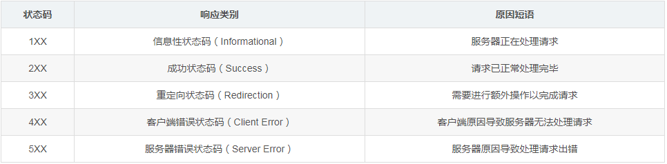

# 浅淡 HTTP 基础

## 一、HTTP 版本历史

* ### ***1.1*** HTTP/0.9

    HTTP 是基于 TCP/IP 协议的应用层协议。它不涉及数据包（packet）传输，主要规定了客户端和服务器之间的通信格式，默认使用 80 端口。

    ` GET /index.html `
    
    上面命令表示，TCP 连接（connection）建立后，客户端向服务器请求（request）网页 ` index.html `。
    
    协议规定，服务器只能回应HTML格式的字符串，不能回应别的格式。

    ```
    <html>
        <body>Hello World</body>
    </html>
    ```
    服务器发送完毕，就关闭TCP连接。
    
    ---
* ### ***1.2*** HTTP/1.0

    1. 简介

    
        1996年5月，HTTP/1.0 版本发布，内容大大增加。

        首先，任何格式的内容都可以发送。这使得互联网不仅可以传输文字，还能传输图像、视频、二进制文件。这为互联网的大发展奠定了基础。

        其次，除了GET命令，还引入了POST命令和HEAD命令，丰富了浏览器与服务器的互动手段。

        再次，HTTP请求和回应的格式也变了。除了数据部分，每次通信都必须包括头信息（HTTP header），用来描述一些元数据。

        其他的新增功能还包括状态码（status code）、多字符集支持、多部分发送（multi-part type）、权限（authorization）、缓存（cache）、内容编码（content encoding）等

    2. 请求格式

        下面是一个1.0版的HTTP请求的例子。

        ```
        GET / HTTP/1.0
        User-Agent: Mozilla/5.0 (Macintosh; Intel Mac OS X 10_10_5)
        Accept: */*
         ```

        可以看到，这个格式与0.9版有很大变化。

        第一行是请求命令，必须在尾部添加协议版本`（HTTP/1.0）`。后面就是多行头信息，描述客户端的情况。

    3. 响应格式
            
            HTTP/1.0 200 OK 
            Content-Type: text/plain
            Content-Length: 137582
            Expires: Thu, 05 Dec 1997 16:00:00 GMT
            Last-Modified: Wed, 5 August 1996 15:55:28 GMT
            Server: Apache 0.84

            <html>
            <body>Hello World</body>
            </html

        响应的格式是" 头信息 + 一个空行`（\r\n）` + 数据"。其中，第一行是"协议版本 + 状态码（status code） + 状态描述"。

    ---
* ### ***1.3*** HTTP/1.1

    1997年1月，HTTP/1.1 版本发布，只比 1.0 版本晚了半年。它进一步完善了 HTTP 协议，一直用到了20年后的今天，直到现在还是最流行的版本。

    1. 持久连接

        1.1 版的最大变化，就是引入了持久连接`（persistent connection）`，即TCP连接默认不关闭，可以被多个请求复用，不用声明 `Connection: keep-alive`。

        客户端和服务器发现对方一段时间没有活动，就可以主动关闭连接。不过，规范的做法是，客户端在最后一个请求时，发送 `Connection: close `，明确要求服务器关闭TCP连接

        ```
        Connection: close
        ```
        
        目前，对于同一个域名，大多数浏览器允许同时建立6个持久连接。
    
    2. 新增其他功能

        1.1版还新增了许多动词方法：`PUT`、`PATCH、HEAD`、 `OPTIONS`、`DELETE`。

        另外，客户端请求的头信息新增了 `Host` 字段，用来指定服务器的域名。

        ```
        Host: www.example.com
        ```

        有了 `Host` 字段，就可以将请求发往同一台服务器上的不同网站，为虚拟主机的兴起打下了基础。
* ### ***1.4*** HTTP/2.0 
    2015年，HTTP/2 发布。它不叫 HTTP/2.0，是因为标准委员会不打算再发布子版本了，下一个新版本将是 HTTP/3。 
    
    由于文章长度原因，这里就不做过多描述感兴趣可以看 [HTTP/2 Specification](https://http2.github.io/http2-spec/)（英文）

## 二、HTTP 协议详解

**`HTTP` 请求由 请求行，请求头（Requset Header），响应头（Response Header），请求正文三部分构成**

* ### ***2.1*** URL 统一资源标识符
    ```
    http://host[":"port][abs_path]
    ```
    * 以上表示要通过 `HTTP` 协议来定位网络资源。
    
    * `host` 表示合法的 `Internet` 主机域名或者IP地址。
    
    * `port` 指定一个端口号，为空则使用缺省端口 `80`，`abs_path` 指定请求资源的URI。
* ### ***2.2*** 请求行

    ```
    GET /example.html HTTP/1.1 (CRLF)
    ```

    HTTP 协议常见的方法 `Method`

    * `GET` 请求获取Request-URI所标识的资源
    * `POST` 在Request-URI所标识的资源后附加新的数据
    * `HEAD` 请求获取由Request-URI所标识的资源的响应消息报头
    * `PUT` 请求服务器存储一个资源，并用Request-URI作为其标识
    * `DELETE` 请求服务器删除Request-URI所标识的资源

* ### ***2.2*** 请求头  Requset


    报头由一系列的键值对组成，允许客户端向服务器端发送一些附加信息或者客户端自身的信息，常见格式

    * `Accept` 请求报头域用于指定客户端接受哪些类型的信息，下面是常见字段的值。

        ```
        text/plain
        text/html
        text/css
        image/jpeg
        image/png
        image/svg+xml
        audio/mp4
        video/mp4
        application/javascript
        application/pdf
        application/zip
        application/atom+xml
        ```
    * `Accept-Encoding`  向服务器申明客户端（浏览器）接收的编码方法，通常为压缩方法
        ```
        Accept-Encoding: gzip, deflate, br
        ```
    * `Accept-Language` 向服务器申明客户端（浏览器）接收的语言
        ```
        Accept-Language: zh-CN,zh;q=0.9,en;q=0.8
        ```
    * `Cache-control` 控制浏览器的缓存
        * 常见的值有：`private`、`no-cache`、`max-age`、`alidate`，默认为 `private`
    * `Refer` 告诉服务器该页面 来源于 哪个页面的链接
        * 值：[https://www.baidu.com](https://www.baidu.com)
    * `User-agent` 告诉客户端将它的操作系统、浏览器和其它属性告诉服务器，常见的统计工具 就是从这个字段读取所需的信息，常见值如下：
        ```
        Mozilla/5.0 (Windows NT 6.1; Win64; x64) AppleWebKit/537.36 (KHTML, like Gecko) Chrome/70.0.3538.110 Safari/537.36
        ```
    ennnnn 你以为这就完了？ 关于请求头字段还有很多，有兴趣可以去看看:smirk:

    >参考链接   [List_of_HTTP_header_fields](https://en.wikipedia.org/wiki/List_of_HTTP_header_fields#Request_fields)（英）

* ### ***2.3*** 响应格式  Response

    服务器的回应如下。

    ```
    HTTP/1.0 200 OK 
    Content-Type: text/plain
    Content-Length: 137582
    Expires: Thu, 05 Dec 1997 16:00:00 GMT
    Last-Modified: Wed, 5 August 1996 15:55:28 GMT
    Server: Apache 0.84

    <html>
    <body>Hello World</body>
    </html>
    ```

    回应的格式是"头信息 + 一个空行（`\r\n`） + 数据"。其中，第一行是"协议版本 + 状态码（status code） + 状态描述"。

    * `Expires` 服务器告诉客户端页面，缓存过期时间
    * `Last-Modified` 请求对象的最后修改日期
    * `Server` 服务器版本信息

    * 常见 `HTTP` 状态码
    * 
        

        参考链接 [常见的HTTP状态码说明](https://cloud.tencent.com/developer/news/7987)

* ### ***2.4*** `Content-Type` 字段

    重点说提一下这个字段，最近有人问我这个字段意思，我问答也是 模凌两可:disappointed_relieved:。

    * 关于字符的编码，1.0版规定，头信息必须是 ASCII 码，后面的数据可以是任何格式。因此，服务器回应的时候，必须告诉客户端，数据是什么格式，这就是 `Content-Type` 字段的作用。

        下面是一些常见的 `Content-Type` 字段的值。
        ```
        text/plain
        text/html
        text/css
        image/jpeg
        image/png
        image/svg+xml
        audio/mp4
        video/mp4
        application/javascript
        application/pdf
        application/zip
        application/atom+xml
        ```
    你会发现跟上面 请求头 `Accept` 是一样的，这些数据类型总称为MIME type，每个值包括一级类型和二级类型，之间用斜杠分隔。

    除了预定义的类型，厂商也可以自定义类型。

    ```
    application/vnd.debian.binary-package
    ```

    上面的类型表明，发送的是Debian系统的二进制数据包。

    `MIME type` 还可以在尾部使用分号，添加参数。

    ```
    Content-Type: text/html; charset=utf-8
    ```

    上面的类型表明，发送的是网页，而且编码是 `UTF-8`。

    客户端请求的时候，可以使用 `Accept` 字段声明自己可以接受哪些数据格式，如上文<a name="请求头">请求头</a>。

    ```
    Accept: */*
    ```

    上面代码中，客户端声明自己可以接受任何格式的数据。

    `MIME type` 不仅用在HTTP协议，还可以用在其他地方，比如HTML网页。

    ```
    <meta http-equiv="Content-Type" content="text/html; charset=UTF-8" />
    <!-- 等同于 -->
    <meta charset="utf-8" /> 
    ```

    **总的来说 这个 `MIME Type` 就像 windows上面文件的后缀名一样，让人和浏览器知道这是什么文件，该作什么处理**。

* ### ***2.5*** `Content-Length` 字段

    在版本 `1.1`，一个TCP连接现在可以传送多个回应，势必就要有一种机制，区分数据包是属于哪一个回应的。这就是Content-length字段的作用，声明本次回应的数据长度。

    ```
    Content-Length: 3495
    ```
    上面代码告诉浏览器，本次回应的长度是3495个字节，后面的字节就属于下一个回应了。

    在1.0版中，`Content-Length` 字段不是必需的，因为浏览器发现服务器关闭了TCP连接，就表明收到的数据包已经全了。

* ### ***2.6*** `HTTP` 缺点

    虽然 `1.1` 版允许复用TCP连接，但是同一个TCP连接里面，所有的数据通信是按次序进行的。服务器只有处理完一个回应，才会进行下一个回应。要是前面的回应特别慢，后面就会有许多请求排队等着。这称为"队头堵塞"（`Head-of-line blocking`）。

    为了避免这个问题，只有两种方法：一是减少请求数，二是同时多开持久连接。这导致了很多的网页优化技巧，比如合并脚本和样式表、将图片嵌入CSS代码、域名分片（domain sharding）等等。如果HTTP协议设计得更好一些，这些额外的工作是可以避免的。

## 三、HTTP 请求过程

 `能看到这里的兄 di 相信都有大致的了解了吧，若是还是不理解的话，下面再来举个栗`。

    我是一个服务器，名字是 `www.bindu.cn` ，门牌号是 `121.42.155.28`，每天得工作就是跟各种浏览器打交道。

    他们总来我这要求取信息、存信息、删信息。可惜我才疏学浅，只稍微学过HTTP协议，所以看得懂用HTTP规定格式发过来的请求信，当然，回复他的时候也是用HTTP规范写回信。

    我家有一个看门的人（服务器进程），每当有浏览器想找我时，他就会过来通知我。

    这不，说着说着他就进来了。

    “报~~~有浏览器找您。”

    “好，跟他连线。”

    OK，TCP连接已建立……

    哒哒哒………打印机将请求报文打印了出来。

    我拿过来看了看。

    只见第一行写着。

    `GET /student/composition/index.html HTTP/1.1`

    “恩，这是用`1.1`版本HTTP规范写的。原来是找我要student文件夹里composition文件夹中的index.html文件啊。”我在心里默念。

    转眼扫到第二行：`Host：www.bindu.cn` 恩，是找我的没错。接着往下看

    第三行：`Connerction：keep-alive` 噢，他跟我说给他发完index.html后不要关闭跟他的连接

    接着看第四、第五行：

    `Accept:text/html`

    `Accept-Language:zh-CN`

    这是在告诉我他能接收哪些类型的信息以及他能接收的语言啊 什么的。然后看最后一行：

    `User-Agent:Mozilla/5.0 (Windows NT 10.0; Win64; x64) AppleWebKit/537.36 (KHTML, like Gecko) Chrome/49.0.2623.112 Safari/537.36`

    噢~~~这是在跟我表明自己的身份啊。

    看完请求报文。我已经明白了这位浏览器客户的需求。赶紧找到`index.html`文件，给这位浏览器客户回信（响应报文）。

    首先表明我使用的规范以及他的请求是成功的。

    `HTTP/1.1 200 OK`

    然后表明我接受获取他获取文件的请求

    `Accept-Ranges: bytes`

    接着告诉他我给他文件的类型

    `Content-Type:text/html; charset=UTF-8`

    写上日期时间：

    `Date:Wed, 13 Apr 2016 13:17:32 GMT`

    告诉他我的个人信息：

    `Server：Apache/2.0.61 (Unix)`

    告诉他内容的长度：

    `Content-Length:1350`

    ……

    把这些声明（响应头）写完了。接下来空一行把他想要的文件内容copy进去（响应体）。

    好了，所有东西写完，我就把信（响应报文）给这位浏览器客户发了过去，让他得到自己想要的文件信息。

**什么？还是不理解？:unamused:那看下旁边有窗户没，有的话打开从那跳下去吧！**

## 结语

前端这几年发生了 翻天覆地 变化，做为一个前端需要不断学习进步，本文仅只是一个学习的总结参考 `不属于原创` ，若是觉得对你有帮助就给个 Start 吧:grin:。

>参考链接
    
* [HTTP 协议入门-作者： 阮一峰](http://www.ruanyifeng.com/blog/2016/08/http.html)
* [Journey to HTTP/2, by Kamran Ahmed](https://kamranahmed.info/blog/2016/08/13/http-in-depth/)
* [HTTP, by Wikipedia](https://en.wikipedia.org/wiki/Hypertext_Transfer_Protocol)
* [HTTP/1.0 Specification](https://tools.ietf.org/html/rfc1945)
* [HTTP/2 Specification](https://http2.github.io/http2-spec/)